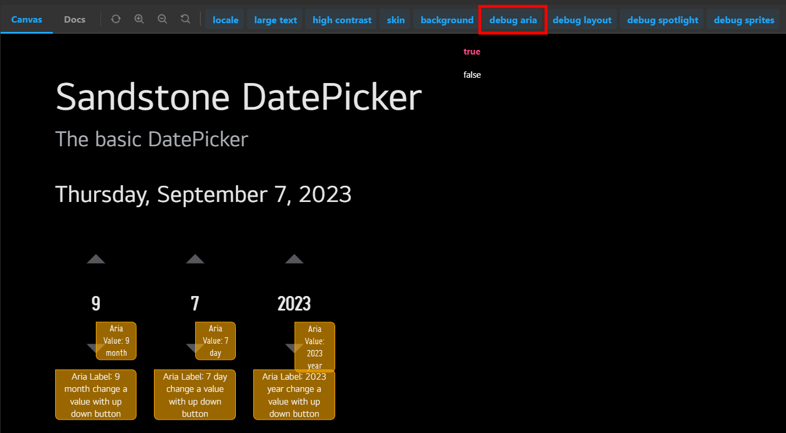

We recognize that applications built using our framework should be usable by anyone regardless of ability. As a result, accessibility has been a key concern for Enact since inception.

## Roles

We address native semantic meaning and accessibility by assigning [ARIA roles](https://developer.mozilla.org/en-US/docs/Web/Accessibility/ARIA/ARIA_Techniques#roles) to custom components. When possible, we've assigned the relevant role to each of our custom components which can be overridden by users if needed.

```js
import CheckboxItem from '@enact/sandstone/CheckboxItem';

const App = (props) => {
	return (
		<div {...props}>
			{/* Renders a CheckboxItem with the default role, checkbox */}
			<CheckboxItem>Sign me up for Enact news!</CheckboxItem>
			{/* Renders a CheckboxItem with the custom role, menuitemcheckbox */}
			<CheckboxItem role="menuitemcheckbox">Sign me up for Enact news!</CheckboxItem>
		</div>
	);
};
```

## Attributes

There are also a set of ARIA attributes that reflect the current state of a component such as `aria-checked` for a checkbox or `aria-valuetext` for a slider. In these cases, Enact will map the public prop (e.g. `selected` or `value`) to the appropriate ARIA attribute.

> In `@enact/sandstone`, some components include additional ARIA configurations specific to webOS. Those may be (or may soon be) overridden by consumers to suit their own requirements.

## Custom Components

We've included a few custom components that may be useful to build accessible applications. These are not required but they can provide some syntactic sugar for ease of development.

### sandstone/Region

[sandstone/Region](../../modules/sandstone/Region/) provides a labeled region to group components. The `title` is wrapped by a [sandstone/Heading](../../modules/sandstone/Heading/) to provide visual context to the `children`. The Heading and `children` are wrapped by a `<div role="region">` with its `aria-label` set to the `title` to provide aural context.

```js
import CheckboxItem from '@enact/sandstone/CheckboxItem';
import Region from '@enact/sandstone/Region';
import Group from '@enact/ui/Group';

const App = () => {
	const items = ['item 1', 'item 2'];

	return (
		<Region title="Select an Option">
			<Group childComponent={CheckboxItem} selectedProp="selected">
				{items}
			</Group>
		</Region>
	);
};
```

### ui/AnnounceDecorator

[ui/AnnounceDecorator](../../modules/ui/AnnounceDecorator/) includes a Hook that provides a method to notify the user of a state change. The method can be called with a string that is inserted into a node with the [`alert` role](https://www.w3.org/TR/wai-aria/#alert).
```js
import Button from '@enact/sandstone/Button';
import {useAnnounce} from '@enact/ui/AnnounceDecorator';
import {useCallback} from 'react';

const ExampleComponent = () => {
	const {announce, children} = useAnnounce();

	const notify = useCallback(() => {
		announce('This text will be alerted to user by TTS');
	}, [announce]);

	return (
		<div>
			<Button onClick={notify}>
				{children}
				Notify on Click
			</Button>
		</div>
	);
};

const App = () => {
	return (
		/* when clicked, the user will be alerted with 'this text will be alerted to user by TTS' */
		<ExampleComponent />
	);
};
```

## Debug Accessibility

Enact also provides ways to debug these accessibility implementations.

### In Sampler

We provide a sampler in [UI COMPONENTS](https://enactjs.com/sampler/sandstone) that implements several UI components as [Storybook](https://storybook.js.org/).
If click the `debug aria` tab located at the top of the page of the sampler and select `true`, the ARIA properties of each component is displayed as shown in the image below.



### In Enact App

This debug feature is designed to work if a class `debug aria` is given to any enact app.
So just add `debug aria` to className prop in your enact app to see the applied ARIA properties.

The following example demonstrates the usage of `debug aira` className.

```js
import ThemeDecorator from '@enact/sandstone/ThemeDecorator';

const AppBase = (props) => {
	return (
		<div {...props}>
			...
		</div>
	);
};
const debugAppBase = () => {
	return (
		<AppBase className='debug aria' />
	);
};
const App = ThemeDecorator(AppBase);
```

