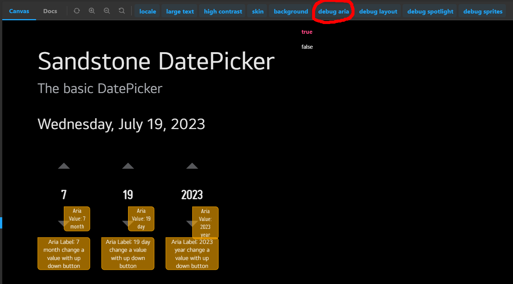

We explained that accessbility can be implemented in Enact in [Accessibility Support in Enact](../../accessibility) section.
Enact also provides a way to debug these accessibility implementations.

## In sampler

There is a sampler in [UI COMPONENTS](https://enactjs.com/sampler/sandstone) that implements several UI components as [Storybook](https://storybook.js.org/).
If click the `debug aria` tab located at the top of the page of the sampler and select `true`, the `aria-label` of each component is displayed as shown in the image below.



## In Enact app

This debug feature is designed to work if a class `debug aria` is given to any enact app.
So just add `debug aria` to className prop in your enact app to get current aria-label.

The following example demonstrates using `debug aira` className

```js
import ThemeDecorator from '@enact/sandstone/ThemeDecorator';

const AppBase = (props) => {
	return (
		<div {...props}>
			...
		</div>
	);
};
const debugAppBase = () => {
	return (
		<AppBase className='debug aria' />
	);
};
const App = ThemeDecorator(AppBase);
```
